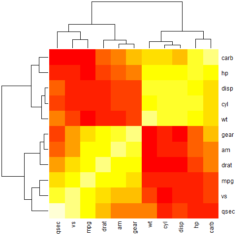

InteractiveStats
========================================================
author: Anirban Chatterjee
date: July 24, 2015
transition: rotate

Delivering the power of R through a GUI, Over the Web!


R in GUI : Why? For Whom?
========================================================
type: sub-section

**Fact** : demand for analytics professionals far outstrips supply  
**Our Idea** : make analytics platforms available to statistics-literate people 
without any prerequisite of coding skills  

**Market Precedents** :  
- SAS has done it (SAS EG), so has IBM (SPSS)  
- GUI-based analytics workbench is still a key differentiator among BI platforms

**R is the only major platform without a consistent GUI**  
<small style="font-size:0.7em">
We hope to bridge the gap with a web-based solution, integrating Cloud/Big Data capability.
</small>


Analysis Steps & Pains in R
========================================================
type: sub-section

The typical analysis pipeline:  
**Explore Data** -> **Variable Interaction** -> **Exploratory Models** -> 
**Model Selection**  

Notice that these steps are fairly constant across problems, and rely heavily on 
graphs to make sense, the Human way!  

So what's wrong with the pipeline?  
<u>Saved scripts have dataset, variables, chart types hard-coded to the data & 
choice of models.</u>  
This nullifies reusability of scripts as the problem statement itself changes.  


How InteractiveStats Helps
========================================================
type: sub-section
transition: zoom

Solution: **don't save scripts**. Click, select, **save workflows!**  
We urge you to launch the [app](https://anirbanc81.shinyapps.io/InteractiveStats) 
as you follow this slide.  

We'll use this example - plot variable correlations of a dataset.  
Using datasets <u>*mtcars*</u> and <u>*esoph*</u> from package **datasets**.  
<small>*Note*: correlation is defined only between numerical variables.</small>  

Code segment from a script for *mtcars* would likely be:

```r
library(datasets); library(reshape2)
mtcarsNumerCols <- sapply(mtcars, is.numeric)
heatmap(cor(mtcars[, colnames(mtcars)[mtcarsNumerCols] ]))
```


How InteractiveStats Helps..
========================================================
type: sub-section
transition: zoom

This will create the below plot
 
Correlation infered from color

***

And a fairly similar code for the *esoph* data.  

We aim to accomplish this with one generic code block that will be reused.
The best part: the code will be auto-generated from user clicks.  

Refer to the <b>*Data Explorer*</b> tab in the app for a preview of our idea.
